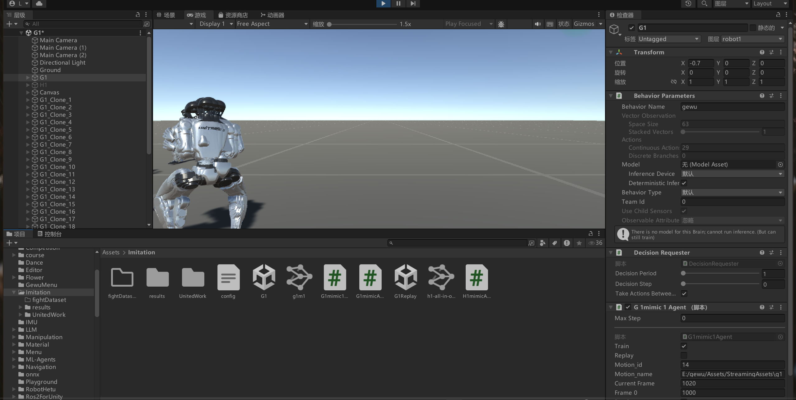

## 2026-4.3 训练数据集拆分

### 本周工作内容

1. **动作分类脚本开发**
   - 实现自动检测动作片段边界
   - 按动作类型分类保存（左勾拳/右勾拳/左踢腿/右踢腿）
   - 输出两类数据：训练数据（含过渡帧）、真实数据（精确动作）

2. **分类逻辑优化**
   - 使用双向阈值判断（0.55）提高分类准确性
   - 增加差异比例判断避免边界误判
   - 添加训练数据重叠警告功能

### 处理结果统计

| 动作类型 | 训练数据 | 真实数据 |
|---------|---------|---------|
| 左勾拳 | 102 | 102 |
| 右勾拳 | 134 | 134 |
| 左踢腿 | 69 | 69 |
| 右踢腿 | 106 | 106 |
| **总计** | **411** | **411** |

### 存在的不足

1. **训练数据重叠问题**
   - 大量相邻动作的训练数据存在重叠（150-300帧）
   - 重叠会导致训练时同一帧数据被多次学习

2. **分类精度仍有偏差**
   - 左右动作数量不平衡（右勾拳比左勾拳多32个）
   - 可能需要更多特征（如腰部转动）辅助判断

3. **数据集平衡性**
   - 左踢腿样本较少（69个），可能影响模型学习

### 改进方向

1. **修复重叠问题**
   - 动态调整过渡帧范围
   - 或使用滑动窗口合并相邻动作

2. **优化分类算法**
   - 增加腰部转动角度特征
   - 考虑动作时序特征（速度峰值位置）
   - 使用机器学习分类器替代规则判断

3. **数据增强**
   - 对少数类样本进行增强
   - 考虑数据平衡策略

### 输出目录

```
ProcessedDataset/
├── train/          # 训练数据（含150帧过渡）
│   ├── 左勾拳/
│   ├── 右勾拳/
│   ├── 左踢腿/
│   └── 右踢腿/
└── real/           # 真实数据（精确动作范围）
    ├── 左勾拳/
    ├── 右勾拳/
    ├── 左踢腿/
    └── 右踢腿/
```

## 2026-03-27 G1拳击动作模仿学习训练

### 本周工作内容
1. 配置G1机器人拳击训练环境
2. 修改 `G1mimic1Agent.cs` 支持多动作循环训练
   - 集成5个fight数据集自动切换
   - 数据集: fight1_subject2/3/5, fightAndSports1_subject1/4

### 训练结果
- 训练步数: 8,329,120 steps
- 训练时长: ~1.8小时
- 平均奖励: 18.74 → 37-40 (提升约100%)

### 产出模型
- `gewu-8329120.onnx

### 下一步
- 在Unity中测试模型效果
- 根据测试结果决定是否继续训练

---
已配置好开始训练

