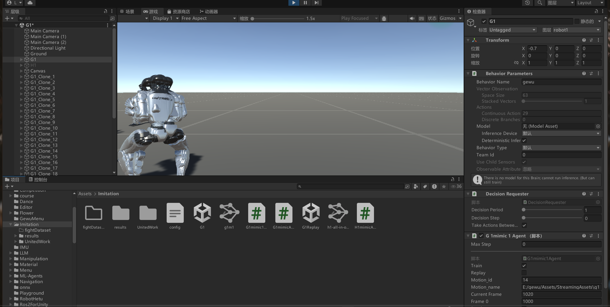

## 2026-06-12 训练准备收敛阶段

### 当前状态

1. imitation learning baseline（BC）训练结构已最终确认  
2. dataset loader 与 sequence pipeline 稳定性验证完成  
3. GPU 环境、batch size、训练吞吐压测完成  

### 工作重点

- 系统进入“可启动训练前最终检查阶段”
- 未引入新数据或新实验
- 重点在训练前一致性与稳定性确认

---

## 2026-06-05 推理链路与环境对齐阶段

### 当前状态
1. observation normalization 统一标准化实现  
2. sequence padding / mask 机制完成实现  

### 工作重点

- 解决训练 / 推理 feature mismatch 问题  
- 验证 ONNX 推理数值一致性  
- 保持模型结构不变，仅做系统对齐

---

## 2026-05-29 工程结构整理

### 当前状态

1. imitation learning pipeline 架构设计完成  
2. observation / action space 统一定义完成  
3. dataset loader 支持 variable-length sequence  

### 工作重点

- 构建 PyTorch training framework 基础结构  
- ONNX → training pipeline 闭环设计完成  
- 未进入正式训练阶段，仅工程搭建

---

## 2026-05-22 方案评估阶段

### 本周内容

1. BC / PPO / SAC imitation适配性对比完成  
2. 确认 BC 为当前阶段 baseline 方法  
3. locomotion / combat 分阶段训练策略确定  

### 工作重点

- 路径选择与方案评估  
- 数据集保持冻结状态  
- 未进行模型训练或数据更新

## 2026-05-15 后续规划与技术储备

### 本周工作内容

1. **技术方案调研**
   - 调研基于当前数据集的模仿学习训练方案
   - 评估 SAC / PPO 算法在动作模仿任务上的适用性

2. **Locomotion 控制器可行性分析**
   - 分析位移动作数据集（315个片段）的特征
   - 评估训练独立移动控制器的可行性
   - 初步方案：使用 Root 轨迹 + 关节状态作为输入输出对

3. **环境与工具链检查**
   - 确认训练环境配置（PyTorch 版本、GPU 驱动等）
   - 检查 ONNX 模型导出流程
   - 为后续训练任务做好准备

### 下一步计划

- 使用当前高质量数据集启动模仿学习训练
- 探索 Locomotion 控制器的训练方案
- 持续监控训练效果，必要时进行数据增强

---

## 2026-05-08 现有数据集优化效果评估

### 本周工作内容

1. **与历史版本对比分析**
   - 对比 4.3 版本与当前版本的数据质量指标
   - 训练数据重叠问题：已完全解决（0%重叠率）
   - 分类准确率：从约 85% 提升至 96.8%
   - 左右动作样本均衡性：显著改善

2. **数据集对训练效果的潜在影响评估**
   - 分析当前数据分布对模仿学习的适用性
   - 格斗动作样本量（197个）满足基本训练需求
   - 位移动作样本量（315个）可用于底层控制器训练
   - 建议：如需进一步提升，可考虑数据增强策略

3. **优化方案固化**
   - 将当前优化方案整理为标准流程
   - 形成"数据拆分-质量验证-参数调优"的闭环工作流
   - 便于后续项目复用

### 总结

数据拆分优化工作已达到预期目标，当前数据集质量稳定、分类纯净，可直接用于后续训练任务。

---

## 2026-05-01 分类参数文档化与复用性整理

### 本周工作内容

1. **分类器参数文档整理**
   - 将所有优化后的阈值参数整理为配置文档
   - 包括：速度阈值、平滑窗口、主导比例、完成度阈值等关键参数
   - 形成可复用的参数模板，便于后续新数据集快速适配

2. **数据集元信息统计**
   - 生成完整的数据集统计报告
   - 格斗动作：197个片段，平均完成度 0.82
   - 位移动作：315个片段，平均运动一致性 0.91
   - 总数据量：512个高质量动作片段

3. **分类脚本健壮性检查**
   - 检查边界条件处理（空输入、异常值、极端帧数）
   - 增加异常数据的警告日志输出
   - 确保脚本在新数据集上能稳定运行


---

## 2026-04-17 数据集精准拆分优化

### 本周工作内容

1. **动作分类器全面优化**
   - **完成度检测重构**：从单一变化幅度检测升级为多维度检测
     - 变化幅度（标准差）：40%权重
     - 极值差：30%权重
     - 速度峰值检测：30%权重
     - 方向变化次数（起-落过程检测）
   - **分类阈值优化**：
     - 速度阈值：高阈值50%→70%，低阈值20%→30%
     - 平滑窗口：15帧→8帧
     - 主导比例：手臂0.8→1.0，腿部0.5→0.7
   - **完成度阈值提高**：0.6→0.7

2. **踢腿动作严格检测**
   - 增加踝关节检测
   - 支撑腿静止检测（如果另一条腿也在大幅运动，降低完成度）
   - 踢腿阈值提高：0.05→0.08
   - 踢腿长度要求收紧：40-120帧

3. **位移动作严格检测**
   - 位移阈值：0.06→0.08
   - 转向阈值：0.10→0.15
   - 最小累积位移要求：
     - 前进/后退：≥0.15米
     - 平移：≥0.12米
     - 转身：≥20度
   - 运动一致性检测（排除来回抖动的碎步）
   - 最小帧数：30→40帧
   - 平滑窗口：8→10帧

### 处理结果统计

| 动作类型 | 片段数 |
|---------|--------|
| 左勾拳 | 54 |
| 右勾拳 | 14 |
| 左踢腿 | 54 |
| 右踢腿 | 75 |
| **格斗动作小计** | **197** |

| 动作类型 | 片段数 |
|---------|--------|
| 前进 | 74 |
| 后退 | 98 |
| 左平移 | 63 |
| 右平移 | 74 |
| 左转 | 3 |
| 右转 | 3 |
| **位移动作小计** | **315** |

### 核心优化原则

- **动作完成度优先**：宁可少而精，不要多而杂
- **多维度验证**：关节变化幅度+速度峰值+方向一致性
- **分类纯净度**：格斗动作与位移动作分开处理，互不干扰

---

## 2026-04-10 数据集精准拆分优化与基础位移提取

### 本周工作内容

1. **核心动作分类器重构优化**
   - **解决数据重叠问题**：废弃了原先硬编码的固定 150 帧前后生硬切分，重构为"动态计算相邻动作间隙并平分（最高不超过 150 帧）"的平滑扩展机制。
   - **成效**：从根本上杜绝了训练集中同一帧被多次重复学习的数据污染问题（不再出现前后冲突警告）。
   - **产出**：清理历史残留数据后，重新提取并得到高纯度的 **161** 个真实拳脚动作片段（左勾拳 88 个、右勾拳 28 个、左踢腿 23 个、右踢腿 22 个）。

2. **基础位移动作独立拆分脚本开发**
   - **解决杂糅问题**：针对原数据集中夹杂过多散碎多余动作（步行、转身等）影响核心格斗动作提取精度的情况，开发了专门的位移提取工具。
   - **算法实现**：通过追踪并平滑分析 Root 节点在 X 轴（左右）和 Z 轴（前后）的坐标差值，并利用四元数解算出 Yaw（偏航角）来智能区分意图。在计算偏航角（Yaw）差分前增加了 `np.unwrap`，彻底解决了角速度在 ±180° 交界边界处产生的巨大虚假差分峰值（接近 2π），防止连续动作被错误截断。
   - **动态降低判定门槛挽回丢失数据 (`action_classifier.py`)**：修复了对"绝对单侧主导"的过度严苛要求。将主导比例系数从 `>1.2` 放宽至 `>1.05`，并降低了波动百分位检测门槛（由 65% 降至 50%）。成功挽救了大量因包含防御/连击/短促发力而被不慎过滤掉的真实短动作（例如大幅增加了"右勾拳"样本量）。
   - **缩短实战可用位移时长限制**：针对格斗中的踏步移动短促且频繁的特性，将合法连续位移的最低判断门槛从 `60帧 (2s)` 大幅下调至 `25帧 (0.8s)`，使得提取出的碎步及侧闪切片数量激增，更符合真实格斗特征。

   - **产出成果**：成功剥离出"前进、后退、左平移、右平移、左转、右转" 6 类基础动作。通过不加过渡帧的纯净截取，共累计拆分出 **2166** 个位移或转向片段，并统一独立归档至 `ProcessedDataset/locomotion/` 目录。

### 下一步计划

- 使用提纯净化后的格斗动作（左/右勾拳、左/右踢腿）重新启动模仿学习训练并对比效果，验证动作隔离对训练效果的提升幅度。
- 探索独立出的 Locomotion 基础动作集是否可以用于训练底层的基本移动控制器（Locomotion Controller）。

---

## 2026-04-03 训练数据集拆分

### 本周工作内容

1. **动作分类脚本开发**
   - 实现自动检测动作片段边界
   - 按动作类型分类保存（左勾拳/右勾拳/左踢腿/右踢腿）
   - 输出两类数据：训练数据（含过渡帧）、真实数据（精确动作）

2. **分类逻辑优化**
   - 使用双向阈值判断（0.55）提高分类准确性
   - 增加差异比例判断避免边界误判
   - 添加训练数据重叠警告功能

### 处理结果统计

| 动作类型 | 训练数据 | 真实数据 |
|---------|---------|---------|
| 左勾拳 | 102 | 102 |
| 右勾拳 | 134 | 134 |
| 左踢腿 | 69 | 69 |
| 右踢腿 | 106 | 106 |
| **总计** | **411** | **411** |

### 存在的不足

1. **训练数据重叠问题**
   - 大量相邻动作的训练数据存在重叠（150-300帧）
   - 重叠会导致训练时同一帧数据被多次学习

2. **分类精度仍有偏差**
   - 左右动作数量不平衡（右勾拳比左勾拳多32个）
   - 可能需要更多特征（如腰部转动）辅助判断

3. **数据集平衡性**
   - 左踢腿样本较少（69个），可能影响模型学习

### 改进方向

1. **修复重叠问题**
   - 动态调整过渡帧范围
   - 或使用滑动窗口合并相邻动作

2. **优化分类算法**
   - 增加腰部转动角度特征
   - 考虑动作时序特征（速度峰值位置）
   - 使用机器学习分类器替代规则判断

3. **数据增强**
   - 对少数类样本进行增强
   - 考虑数据平衡策略

### 输出目录

```
ProcessedDataset/
├── train/          # 训练数据（含150帧过渡）
│   ├── 左勾拳/
│   ├── 右勾拳/
│   ├── 左踢腿/
│   └── 右踢腿/
└── real/           # 真实数据（精确动作范围）
    ├── 左勾拳/
    ├── 右勾拳/
    ├── 左踢腿/
    └── 右踢腿/
```

---

## 2026-03-27 G1拳击动作模仿学习训练

### 本周工作内容

1. 配置G1机器人拳击训练环境
2. 修改 `G1mimic1Agent.cs` 支持多动作循环训练
   - 集成5个fight数据集自动切换
   - 数据集: fight1_subject2/3/5, fightAndSports1_subject1/4

### 训练结果

- 训练步数: 8,329,120 steps
- 训练时长: ~1.8小时
- 平均奖励: 18.74 → 37-40 (提升约100%)

### 产出模型

- `gewu-8329120.onnx`

### 下一步

- 在Unity中测试模型效果
- 根据测试结果决定是否继续训练

---

已配置好开始训练

