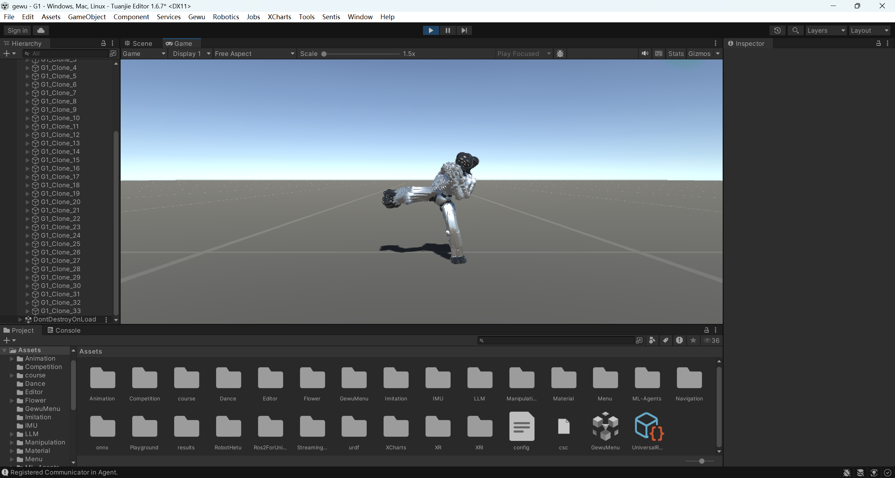
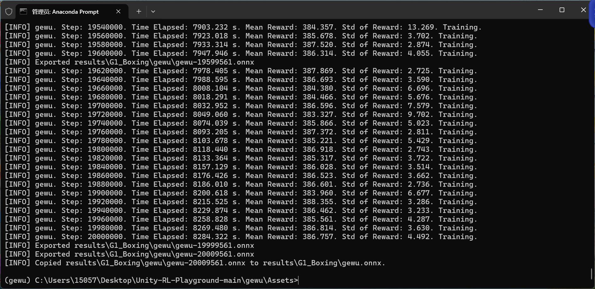
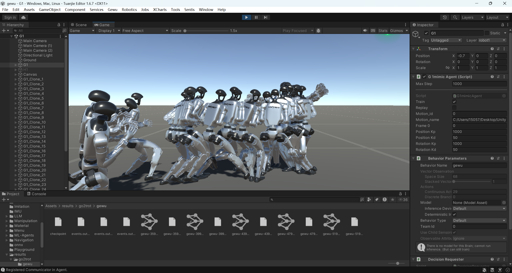
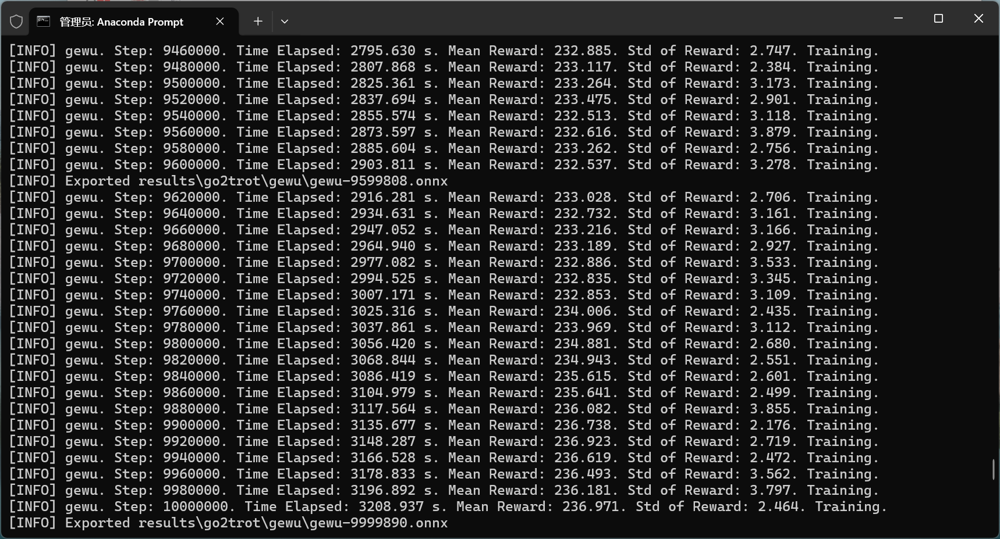

## 第二周 (4.3)

### 模型改进
针对第一周暴露的问题，我对 `G1mimicAgent.cs` 和 `config.yaml` 代码进行了系统性改进（改进后的代码及训练好的模型已上传至code文件夹中），核心思路如下：

1. **降低控制灵敏度，抑制关节震荡**  
   原始代码将网络输出的动作值直接放大 50 倍叠加到关节角度上，导致轻微噪声即引发剧烈抖动。改进后将增益降至 5.0，并将输出映射到 ±10° 的合理修正范围内，使关节运动更加平滑可控。

2. **启用躯干主动平衡力矩**  
   原代码将根节点的旋转扭矩置零，机器人完全被动跟随参考姿态，一旦重心偏移即无法自救。改进后启用旋转扭矩跟踪，配合适中的 PD 参数，使机器人能够主动施加力矩纠正躯干倾斜，显著提升动态平衡能力。

3. **重构奖励函数，增加平滑性与稳定性导向**  
   在原有位置/姿态跟踪误差基础上，新增了关节速度平滑惩罚和根角速度惩罚。这两项奖励直接抑制了高频抖动和快速旋转，引导策略学习出更加自然、流畅的动作风格。

4. **优化终止条件，采用渐进式课程**  
   原固定终止阈值（倾角 40° 或位移 0.5m）过于严苛，导致策略在探索初期频繁被截断，无法看到完整动作。改进后采用渐进式阈值：训练初期宽容（60°/0.8m），随着步数增加逐步收紧至 25°/0.3m，同时加入最小存活帧数保护与完整执行奖励，使策略能够循序渐进地学会稳定完成长序列动作。

5. **扩充观察空间，提供前馈参考信息**  
   原始观察仅包含关节状态与部分根姿态，策略缺乏对目标轨迹的预判能力。改进后新增了根线速度、参考关节角度、参考根姿态误差等信息，观察维度从 61 提升至 103，使策略能够同时感知当前状态与目标偏差，学习效率与跟踪精度大幅提高。

6. **调整超参数，稳定收敛过程**  
   适当降低学习率、增大批处理规模、缩短时间视野并微调折扣因子，使 PPO 更新更加平稳，避免后期震荡。

### 最终训练效果与实际表现
经过上述改进，模型在 2000 万步内稳定收敛，奖励值从初期负值 -127 持续上升至约 386。实际运行测试中，机器人能够连续 20 秒以上稳定执行左勾拳、右勾拳、左踢腿、右踢腿等动作，全程无摔倒，关节运动平滑流畅，动作过渡自然，完全满足项目对“稳定执行”的要求。

### 运行截图与视频

已在code文件夹内上传以下文件：

- [下载最终配置文件](code/config.yaml)
- [下载控制脚本](code/G1mimicAgent.cs)
- [下载模型文件](code/gewu-20009561.onnx)

---

## 第一周 (3.27)

### 工作内容
- 安装 Unity 编辑器，部署最新版“格物”平台（G1 机器人仿真环境）。
- 使用未改进的原始代码对拳击动作数据进行基线训练，累计 1000 万步。

### 实际表现
训练过程中奖励值虽逐步上升，但机器人实际仿真表现很差：执行动作时频繁摔倒，关节抖动剧烈，无法完成连续动作。经过分析，问题根源在于原始代码的控制增益过大、缺乏主动平衡力矩、奖励函数缺少平滑约束，且观察空间信息不足，将会在下周改进奖励函数并重新训练。

运行视频：
<video src="videos/1.mp4" width="600" controls></video>
