## 第十周 (5.29) — Unity 场景集成、物理碰撞系统搭建与训练环境落地

本周完成拳击赛场景在团结引擎（Tuanjie/Unity）中的集成、物理碰撞体系搭建、资产封装与团队分享，并最终接入 G1 机器人模仿学习训练环境，使机器人能够在真实擂台中进行拳击对战仿真。

### 工作内容

1. **FBX 导入**
   将上周导出的 FBX 导入团结引擎项目，并建立标准化资源目录结构（`Models/`、`Materials/`、`Textures/`、`Prefabs/`），便于团队协作与后续维护。导入后核查根物体 Transform，确认缩放为 `(1,1,1)`、旋转归零，验证了上周变换归一化的有效性。

2. **材质与贴图提取、渲染校正**
   通过 FBX 导入设置中的 **Extract Textures / Extract Materials** 将内嵌贴图与材质提取至独立目录，使其可在引擎内编辑。针对 Blender 与 Unity 色彩空间差异导致的材质偏暗问题，逐一指定 Base Map 并调整 Smoothness / Metallic 参数，还原擂台、围绳、护角等材质的真实质感。

3. **碰撞体系统搭建**
   这是本周的核心与难点。为避免直接对整套高模添加 Mesh Collider 带来的性能开销与凹形碰撞失效问题，采用"按部位手动添加简单碰撞体"的策略，对擂台各功能部件分别配置：
   - **台面 `boxing_ring_arena_mesh.002`**：添加 Box Collider，逐面调整 Center 与 Size，使碰撞盒顶面与视觉台面严格齐平，避免机器人足部陷入或悬空。
   - **四根角柱 `boxing_ring_corner_cushions_002_mesh.002`**：由于四根角柱共属同一网格物体，引擎自动生成的单个 Box Collider 会将四柱之间的空白区域一并包入。考虑到对战仿真中角柱仅需提供"阻挡机器人冲出擂台"的物理边界、对精确外形要求不高，采用在同一物体上叠加 4 个独立 Box Collider 的方案，分别调整 Center / Size 包裹各角柱，在保证物理边界正确的同时兼顾了实现效率。（注：角柱实际为三棱柱外形，已评估 Mesh Collider+Convex 与 Capsule 等替代方案的精度/性能权衡，最终选定 Box 多碰撞体方案）
   - **围绳 `Retopo_boxing_ring_ropes_mesh.003`、`Retopo_boxing_ring_ropes_mesh.004`**：沿围绳走向布置细长 Box Collider，构成擂台四周的物理围挡，为后续实现"机器人撞绳反弹"等交互预留接口。

   

4. **"Is Trigger 穿模"问题的定位与修复**
   碰撞测试初期出现机器人/测试物体直接穿过台面的现象。逐项排查后定位根因：台面 Box Collider 误勾选了 **Is Trigger**。触发器（Trigger）仅用于检测物体进入而不产生物理阻挡，故无法承托物体。取消勾选后台面恢复正常物理碰撞。

5. **碰撞测试与验证**
   采用"标准 Cube + Rigidbody"作为临时测试体，从擂台上方自由下落进行碰撞验证：确认测试体能稳定停落于台面而不穿透、不抖动、不卡入，且四周围挡与角柱均能正确阻挡。验证通过后方进入正式集成。

   https://github.com/user-attachments/assets/4446de73-d102-4088-8f30-51db35981e35

6. **Prefab 封装与 Unity Package 团队分享**
   将配置完成的擂台（含完整碰撞体系、材质、子物体层级）从 Hierarchy 拖拽至 `Prefabs/` 目录封装为 **Prefab 预制体**，实现配置的持久化与跨场景复用——后续任意训练/对战场景只需拖入该 Prefab 即可获得完全一致的可碰撞擂台。随后通过 **Export Package（勾选 Include Dependencies）** 将 Prefab 及其依赖的材质、贴图、模型一并打包为 `.unitypackage`，分享给团队成员，统一了团队的场景资产基线。

7. **接入 G1 模仿学习训练环境**
   将封装好的擂台 Prefab 集成进 G1 机器人模仿学习项目，替换原有的空白训练地面。集成后，G1 机器人可在具备完整物理边界与视觉上下文的真实擂台中执行模仿学习训练与拳击对战仿真（见下图），为项目从"单体动作"迈向"擂台对战"提供了场景支撑。

   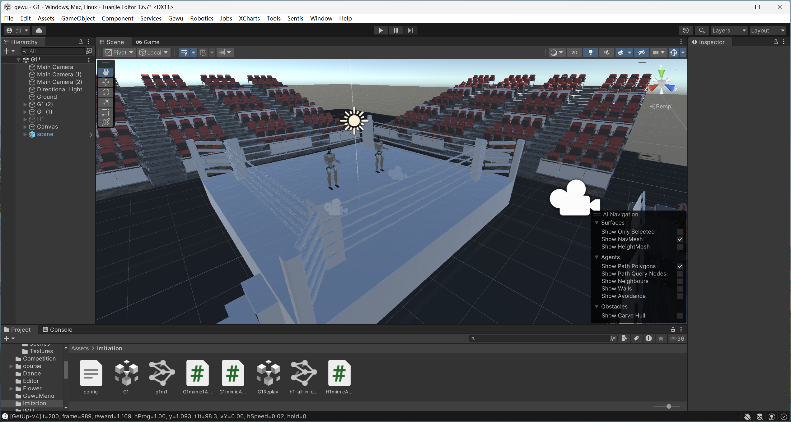

### 阶段成果

- 完成拳击赛场景在团结引擎中的完整集成，擂台台面、角柱、围绳均具备正确的物理碰撞，机器人可稳定站立、移动而不穿模。
- 将擂台封装为可复用 Prefab 并以 Unity Package 形式完成团队分享，统一了场景资产。
- 成功将场景接入 G1 模仿学习训练环境，G1 机器人已可在真实擂台内进行对战仿真。

打包后的场景资产（`BoxingRing.zip`，约 752 MB）及相关工程文件已上传至项目仓库。

### 下周计划

- 优化观众席等环境物件的渲染性能（GPU Instancing / 静态合批），降低场景 Draw Call。
- 完善围绳的弹性碰撞反馈，实现机器人撞绳后的反弹交互。
- 配合对战逻辑，在擂台四周补充不可见边界墙，防止机器人意外冲出擂台。

---

## 第九周 (5.22) — 拳击赛场景的获取、模型适配与导出

本周起，项目从"机器人单体动作训练"进入"对战场景搭建"阶段。目标是为 G1 机器人模仿学习提供一个真实、规范、可碰撞的拳击赛擂台环境，替代此前训练所用的空白地面，使后续的拳击对战仿真具备完整的场景上下文与物理边界。

### 工作内容

1. **场景模型选型与结构分析**
   选用一套高精度拳击赛场馆 3D 资产（含擂台、围绳、护角、玻璃护栏、观众席、灯光桁架、LED 大屏等），原始格式为 Blender `.blend` 工程文件。导入后对场景层级（Outliner）进行了系统梳理，明确各集合的归属与用途：`01 BOXING RING`（擂台主体）、`02 LIGHTS`（28 个聚光/区域光源）、`03 CAMERA`、`01 OBJECTS`（观众席、桁架等环境物件）、`Boxing ring`、`Glass Handrail with lines` 以及若干 `Empty` 辅助空物体。该步骤为后续的导出裁剪与碰撞规划提供了依据。

2. **多用户（Multi-User）数据问题排查与修复**
   在尝试对模型执行"应用全部变换（Apply All Transforms）"时，控制台抛出大量 `Cannot apply to a multi user: Object "Floor0X.001", Mesh "Floor01_..."` 报错，导致变换无法应用。经分析，根因在于原作者为压缩文件体积，对场景内数十个地板/座椅物体采用了**关联复制（Alt+D）**，使多个物体共享同一份网格数据（Multi-User Data），Blender 出于数据一致性保护禁止对其单独应用变换。
   解决方案：全选目标物体后执行 **物体 → 关系 → 单用户化 → 物体与数据（Make Single User → Object & Data）**，将每个物体的网格数据独立化，随后顺利完成变换应用。

3. **3D 模型坐标与单位的归一化适配**
   对导入模型逐一核查变换属性，发现并修复了三类会直接破坏 Unity 导入效果的问题：
   - **缩放未归一**：部分物体缩放值为 `0.011`（即被缩小至原尺寸的 1.1%），若直接导出会导致 Unity 中 Transform 缩放异常，进而引发物理碰撞、动画驱动的尺度错乱。通过 **Ctrl+A → 全部变换** 将缩放归一为 1.0。
   - **旋转未归零**：部分物体存在 `X=90°`、`Z=-270°` 等残留旋转，源于资产跨软件导入时的轴向差异。统一应用变换后归零，避免子物体层级与朝向计算混乱。
   - **单位制不一致**：工程显示单位为厘米（cm），而 Unity 默认 1 单位 = 1 米。核对擂台真实尺寸（约 6.1m × 6.1m）并在场景属性中将单位系统统一为公制·米，确保导入后比例正确。

4. **导出范围裁剪与场景轻量化**
   考虑到机器人对战仿真对实时性能的要求，对导出内容进行了有针对性的取舍：保留擂台主体、护角、围绳、玻璃护栏等核心几何体；剔除 `02 LIGHTS` 全部光源（Unity 端自行布光，效果更可控且避免重复光照）、`03 CAMERA`、以及全部 `Empty` 辅助物体，从源头减少无效 Draw Call 与场景冗余。

5. **FBX 导出参数配置**
   采用 **FBX 导出**作为 Blender → Unity 的资产交换方案（相比直接拖入 `.blend`，FBX 不依赖本地 Blender 环境，更利于团队协作与版本管理）。关键参数设置：勾选"仅选中的物体"；物体类型仅保留"网格"；缩放 1.0、应用缩放 = `FBX 全部`；前进方向 = `-Z`、向上方向 = `Y`（对齐 Unity 的 Y-up 坐标系）；勾选"应用单位制"；路径模式 = 复制并启用**贴图嵌入**，保证材质贴图随 FBX 一并迁移。

6. **材质渲染校验**
   通过切换视口着色模式（实体 → 材质预览）确认模型材质完整，擂台地面、Everlast 标识、围绳、观众席座椅等贴图均正常显示，排除了"无材质纯灰模型"的可能，为 Unity 端材质还原奠定基础。

### 阶段成果

完成了一套结构清晰、变换归一、单位规范、可正确导出的拳击赛场景 FBX 资产。模型在 Blender 中渲染效果完整（见下图），为下一周的 Unity 集成与物理碰撞搭建做好了准备。

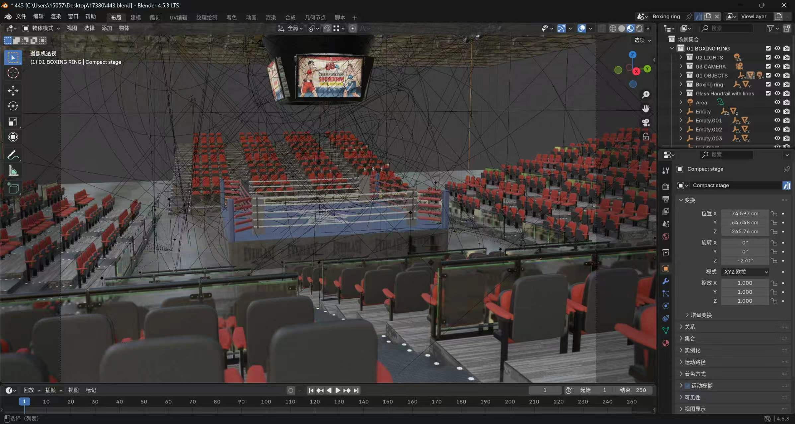

---

## 第八周 (5.15) — 起身动作的系统性重构与反向课程训练成功

基于第七周的失败教训，本周对起身训练做了系统性重构（v3），并在直接训练再次受挫后，通过诊断定位问题、补入平衡奖励、并引入**反向课程学习（Reverse Curriculum）**，最终成功让机器人从倒地状态完整起身并稳定站立。

### 工作内容

1. **v3 重构：回归模仿学习本质**
   参考 DeepMimic 类方法的核心配方，对训练框架做了系统性重写：
   - **参考状态初始化（RSI）**：每回合在起身参考轨迹上随机选取起始帧并将机器人瞬移到该帧姿态，使大量回合能从"接近站立"处开始拿到高奖励，再让价值函数沿时间向前反向传播。
   - **基于跟踪误差的终止**：以"与参考 root 位置/高度的偏离过大"作为终止条件，替代死板的绝对高度/角度阈值。该判据早期允许躺、后期要求站，天然适配各阶段，并直接消除了 v1"躺平刷分"的退化解。
   - **纯模仿奖励**：只保留姿态、root 位置、root 高度、root 朝向、关节速度五项指数型奖励（权重和≈1），删除全部任务奖励与反作弊惩罚。爬行/弹射因不匹配参考而自然得低分，无需手写惩罚，从根上堵死了 v2 的投机漏洞。
   - 另外扩充观测（加入相位与参考 root 高度），并恢复了足够的执行器力矩。

2. **v3 直接全程训练仍失败：地上挣扎蠕动**
   用 v3 直接对完整起身区间训练，机器人仍在地上挣扎、蠕动，无法起身，奖励长时间停滞在低位（见下图）。

   **原因分析**：即便开了 RSI，真人参考起身偏快、力矩受限的机器人物理上跟不上——从倒地开始的回合，机器人撑到一半就落后于参考，跟踪误差迅速增大、被误差终止"掐断"在起身途中。于是"从躺到起"这一最难阶段的回合永远走不完，价值无法向前传播，RSI 的 bootstrap 链条在此断裂。

   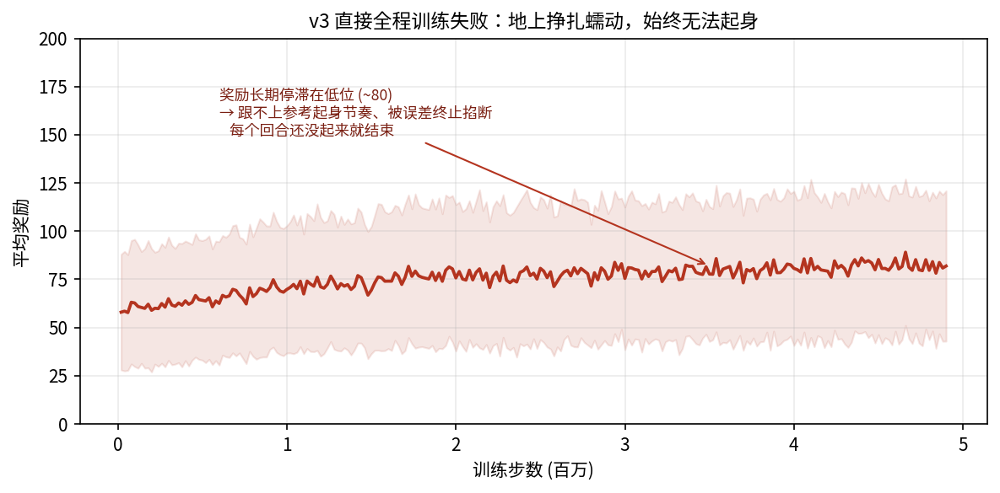

   该阶段失败的实际表现见录屏：**8.1.mp4**（机器人在地面反复挣扎、无法起身）。

   https://github.com/user-attachments/assets/908f32d3-bf2a-47a0-bac6-b1f125c1d5f6

3. **诊断：用 Replay 区分病因**
   为判断"是参考姿势本身站不稳，还是纯 RL 学习问题"，用 Replay 模式（纯参考驱动、无策略）验证站立帧：机器人在纯参考下能稳稳站住。这说明姿势与物理本身没问题，问题出在 RL 学习与奖励设计——具体地，纯姿态跟踪缺少一个直接指向"保持竖直、别晃倒"的梯度，机器人能凑到站立姿势却学不会主动平衡。

4. **v3.1：加入相位门控的平衡奖励**
   针对"站不稳"的诊断结果，新增一组仅在站立保持段生效（相位门控）的平衡奖励：奖励"身体竖直（up 向量对齐）+ root 静止（线/角速度小）"。门控是关键——躺/起身阶段身体是横的，绝不能奖励竖直，否则会逼机器人提前乱站、把投机漏洞又开回来。该奖励不可被投机（无法一边躺着一边又竖直又静止），安全且直接引导稳定站立。

5. **反向课程学习：分段攻克长时程难题**
   即便有了 RSI 与平衡奖励，直接全程训练对"从全躺起身"仍过难。于是采用反向课程：**先只训练接近站立的最后一小段，再将起始点逐段向前（向更倒地的方向）移动**，每段用 `--initialize-from` 继承上一段的策略权重：

   起始帧调度：`7180 → 7100 → 7040 → 6990 → 6960`（终止帧固定 7230），共五段接力。每段保持 RSI 开启，以"奖励进入平台 + 标准差收窄 + 仿真中能可靠站立"作为推进下一段的判据。

   前两段的训练曲线如下（见下图）：
   - **第一段（7180→7230）**：加入平衡奖励后，奖励从约 130 一路爬升至约 406（接近理论上限 420），机器人稳定站立、不再晃倒，验证了平衡奖励与课程策略的有效性。
   - **第二段（7100→7230）**：从第一段策略热启动，起点前移至 7100（动作更长、更难），奖励爬升至约 310，机器人能从更低的姿态起身并站稳。该段奖励上限略低于第一段、方差更大，属正常现象——起点越靠前，起身过程越长、保持站立的时间占比越小、难度越高。

   后续第三至第五段在此基础上逐段把"起身"接续向前，最终覆盖到从全躺起身。

   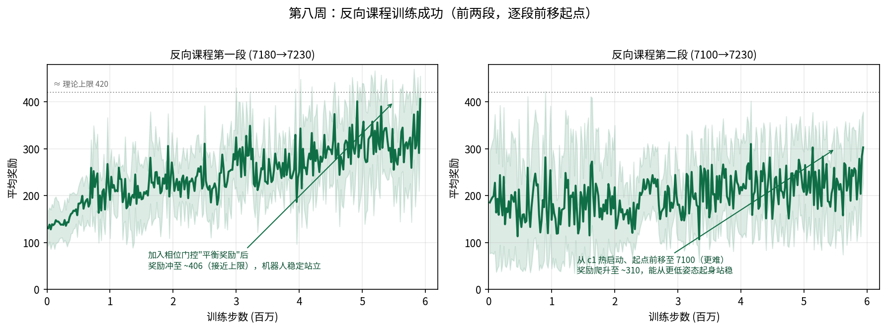

6. **最终结果：完整起身并稳定站立**
   经五段反向课程接力训练，机器人最终能够**从倒地状态完整地翻身、收腿、撑起并稳定站立**，动作连贯、站立后不摔倒。最终模型为 `gewu-7999921(GetUp).onnx`，实际效果见录屏：**8.2.mp4**（机器人由蹲伏低位逐步起身、最终稳稳站直）。

   https://github.com/user-attachments/assets/e1679ba7-fd75-4689-8a0b-d8093fd9cec1

### 阶段成果与方法学总结

本周完整走通了起身这一高难度长时程动作的训练，成果包括：
- 完成 v3 重构（RSI + 误差终止 + 纯模仿奖励），并通过 Replay 诊断 + v3.1 平衡奖励解决了"站不稳"问题；
- 采用五段反向课程成功训练出从全躺起身的策略，机器人能完整起身并稳定站立（见 8.2.mp4）；
- 产出最终模型 `gewu-7999921(GetUp).onnx`。
- [训练好的起身 onnx 模型](models/gewu-7999921(GetUp).onnx)

**方法学层面的几点关键认识（也是这两周失败迭代换来的）：**
1. **纯模仿奖励优于任务奖励堆叠**：v1/v2 的失败说明，靠"任务奖励 + 反作弊惩罚"会不断开出可被投机利用的漏洞；把"防作弊"交给参考轨迹本身（不匹配参考即低分）才是根治之道。
2. **RSI + 误差终止是长时程动作的关键**，但其前提是机器人能跟上参考；跟不上时需要反向课程（或放慢参考）来逐段攻克。
3. **奖励数值不等于成功**：v1 奖励高达 990 却是彻底失败，成功与否最终要看行为（能否真正起身、站稳），而非奖励数字。
4. **诊断先于调参**：用 Replay 区分"物理/姿势问题"与"RL 学习问题"，避免在错误方向上盲目调参。

### 下周计划

- 增强起身策略的鲁棒性（加入随机外力干扰训练），以适应拳击对战中被击倒的多样化倒地姿态。

---

## 第七周 (5.8) — 起身动作的初步尝试与失败迭代（v1 / v2）

本周进入分动作训练中难度最高的一个动作——**起身（Get-Up，机器人从地面爬起并站立）**的模仿学习训练。起身不同于拳、踢等短动作：它是一个长时程、多阶段的动作（平躺 → 翻身/俯撑 → 收腿 → 起立），机器人在初始即处于倒地状态，状态空间大、奖励信号靠后，是模仿学习中公认的难题。本周完成了两个版本（v1、v2）的尝试，均告失败，但失败过程清晰地暴露了问题所在，为后续的系统性重构提供了方向。

### 工作内容

1. **起身动作的难点分析**
   对起身任务做了难点拆解：动作时程长（一次起身约 2.5 秒、数百帧），需要从倒地的不稳定姿态逐步过渡到站立的不稳定平衡，且中间任一阶段失衡都会导致整体失败。这意味着稀疏/靠后的奖励难以引导前期探索，需要专门的初始化与奖励设计。

2. **v1 版本尝试与失败：机器人地上蠕动**
   v1 沿用了拳/踢动作的模仿奖励框架（姿态跟踪 + 存活奖励），并放宽了回合终止条件。训练结果是机器人始终趴在地上蠕动、扭动，从不尝试起身。
   **原因分析**：从奖励曲线看，平均奖励从训练一开始就稳定在约 990 的高位、并全程平直不变（见下图左）。这是一个典型的**退化最优解**——由于存活奖励持续发放、且回合几乎不会提前终止，机器人发现"躺着不动，每步都能领取存活奖励"就能把单回合奖励累积到约 1000 分，于是完全没有动力去完成困难的起身。高奖励在这里是"虚高"，掩盖了任务的彻底失败。

3. **v2 版本尝试与失败：地上爬行 / 从地面弹射**
   针对 v1"不愿起身"的问题，v2 在奖励中加入了任务导向项（如"抬高躯干"奖励、起身成功奖励）以激励起身。训练约 860 万步后，机器人开始有动作，但表现为在地上爬行、尝试站立、甚至从地面突然弹射起来，始终无法完成正常起身。
   **原因分析**：奖励曲线长期停滞在约 100、且整个训练过程成功起身 0 次（见下图右）。问题在于新增的任务奖励被"薅"了——机器人发现把躯干瞬间抬高就能骗取"抬高奖励"，于是演化出爬行、弹射等投机行为，而不是按真实参考动作起身。每堵一个投机行为就要再加一条惩罚，陷入打地鼠式的恶性循环。

### 阶段小结

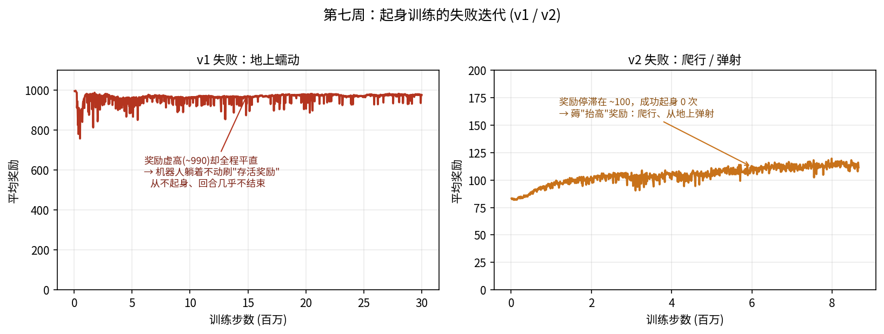

两次失败指向同一个教训：**单纯靠堆叠"任务奖励 + 反作弊惩罚"无法学会起身**，反而不断开出可被投机利用的奖励漏洞。v1 暴露了"无有效终止 → 躺平刷分"的退化解，v2 暴露了"任务奖励可被薅 → 投机行为"的漏洞。要根治，必须回到模仿学习的本质：用稠密、不可投机的奖励引导机器人严格跟随真实起身轨迹，并配合合理的初始化与终止机制。这成为第八周系统性重构的出发点。

---

## 第四周 (4.17) — 拳类动作的模仿学习训练（右勾拳 / 左直拳）

本周目标是基于真实动作捕捉数据逐个训练拳击动作。本周完成了两个拳类动作的训练：**右勾拳（RightHook）** 与 **左直拳（LeftStraight）**，二者均取自同一段动作捕捉数据 `fight1_subject2`（Motion_id = 14）的不同帧区间。训练沿用了分动作训练统一的 Agent 代码框架（与右踢腿动作共用同一套模仿学习代码），并针对拳类动作的特点采用了两阶段课程训练。

### 工作内容

1. **复用统一的模仿学习框架**
   两个拳类动作均基于统一的 Agent 框架训练，其核心包括：全部 29 个关节（含手臂）均接受神经网络的动作修正——这对拳类动作尤为关键，因为出拳正是由手臂关节主导；以指数型奖励对参考动作做稠密的姿态/速度/根节点跟踪；以及"两阶段课程"训练机制。与踢腿需要躯干侧倾不同，拳类动作全程保持站立，因此第二阶段引入的站立奖励能让机器人在出拳时保持躯干竖直、下盘稳定。

2. **右勾拳（RightHook）配置与训练**
   - 配置：`Motion_id = 14`，`Motion_name = fight1_subject2`，`Frame_start = 2400`，`Frame_end = 2740`（约 340 帧）。
   - 两阶段训练：先训练出拳动作本身，在 **1000 万步**处打开站立奖励（`standing_reward = 0.3`）。
   - 训练表现：第一阶段奖励由约 92 稳步上升、至 900 万步左右进入约 280 的平台；1000 万步打开站立奖励后，奖励跳升至约 355，并最终爬升至约 450（峰值约 469）。机器人能保持站立姿态完成右勾拳、出拳后稳定不倒。
   - 产出：模型 `gewu-12622793_RightHook_.onnx`；录屏 `4_1.mp4`。

   https://github.com/user-attachments/assets/f07557b7-1029-47ce-9835-2fc5f19ae70b

3. **左直拳（LeftStraight）配置与训练**
   - 配置：`Motion_id = 14`，`Motion_name = fight1_subject2`，`Frame_start = 2950`，`Frame_end = 3140`（约 190 帧，动作更短、更快）。
   - 两阶段训练：在 **800 万步**处打开站立奖励（`standing_reward = 0.3`）。
   - 训练表现：第一阶段奖励上升后，在 7–8 百万步处稳定于约 177、且**标准差趋近于 0**——表明"仅出拳"这一目标已被学满、策略收敛为近确定性动作；800 万步打开站立奖励后，奖励随即跳升至约 256，并最终爬升至约 397。机器人能站立完成左直拳、出拳干脆且站姿稳定。
   - 产出：模型 `gewu-11999935_LeftStraight_.onnx`；录屏 `4_2.mp4`。

   https://github.com/user-attachments/assets/578edc8d-abd3-42fd-855c-c614119707d5

### 训练过程与结果

两个动作的训练曲线均清晰呈现了两阶段课程的特征形态（见下图）：第一阶段专注出拳动作、奖励上升至平台（左直拳尤为典型——平台期标准差降至约 0，说明出拳目标已学满）；在指定步数打开站立奖励后，奖励显著跳升、机器人在出拳的同时学会保持稳定站立。

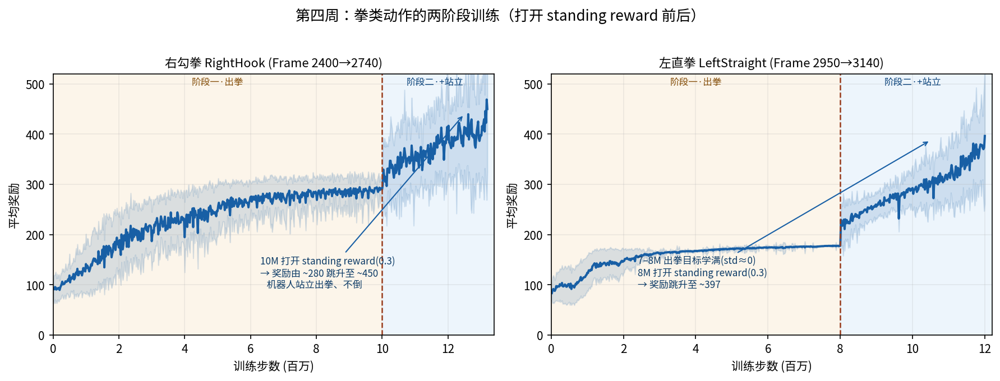

**方法学说明**：第二阶段的奖励跳升（右勾拳约 280→450、左直拳约 177→397）中，有相当一部分是"机械性"上升——打开站立奖励相当于新增了一个奖励项，总奖励量纲随之变大，因此打开前后的奖励数值不在同一标准下、不可直接比较。本次训练成功的真正判据是行为（出拳是否到位、出拳后能否稳定站立），仿真录屏已验证两个动作均站立出拳、稳定不倒，而非单纯依据奖励数值。这一点与右踢腿训练中的认识一致。

### 阶段成果

- 完成右勾拳、左直拳两个拳类动作的模仿学习训练，均能由真实动作数据驱动、打出预期且顺滑的动作，并在出拳后保持稳定站立。
- 产出两个动作模型：`gewu-12622793(RightHook).onnx`、`gewu-11999935(LeftStraight).onnx`，效果见录屏 `4.1.mp4`、`4.2.mp4`。
- [训练好的右勾拳onnx模型](models/gewu-12622793(RightHook).onnx)
- [训练好的左直拳onnx模型](models/gewu-11999935(LeftStraight).onnx)

---

## 第三周 (4.10) — 右踢腿动作的模仿学习训练

本周属于"分动作模仿学习训练"任务的第一部分。目标是基于真实动作捕捉的 CSV 数据，逐个动作（左拳、右拳、左踢腿、右踢腿）独立训练，自主完成奖励函数的设计与调优，使最终模型能够依据真实动作数据打出预期且顺滑的动作。本周聚焦于**右踢腿**动作的训练。

右踢腿对应动作数据 fight1_subject2.csv（Motion_id = 14） 的第 1800–2000 帧（30 fps 采集，插值到 100 Hz 后为第 6000–6667 帧），是一个有明确起止、需要单腿离地的**单次高动态动作**，对平衡控制要求显著高于拳类动作，是本阶段难度较大的一个动作。

### 工作内容

1. **定位并修复原始代码中腿部关节 RL 失效的关键 Bug**
   在分析原始 `G1mimic1Agent.cs` 时发现：动作增益 `kb` 在 `OnActionReceived` 的关节循环外声明，循环内一旦执行到 `if (i >= 15) kb = 0;`，`kb` 便被永久置零，导致索引 15–28 的腿部关节完全不接受神经网络的动作修正，只能被动跟随参考轨迹的前馈值。这一缺陷对走路等动作影响有限，但对踢腿这类核心依赖腿部主动控制的动作是致命的——策略无法对腿部施加任何平衡修正，理论上根本无法学会稳定踢腿。
   修复方案：将 `kb` 改为每个关节独立计算的 `kb_i`（训练时全部为 40，replay 时为 0），使包括腿部在内的全部 29 个关节都能接受策略修正。该修复是右踢腿能够训练成功的前提。

2. **重构奖励函数：由线性惩罚改为指数型奖励**
   原始奖励采用线性惩罚（如 `-0.5 × 位置误差`），梯度尖锐且无界。参考 DeepMimic 类模仿学习的通行做法，将各项重构为指数型奖励 `exp(-k·误差²)`，输出有界于 [0, 1]、梯度平滑，更利于稳定收敛。最终奖励由 7 项加权构成：

   | 奖励项 | 权重 | 作用 |
   |---|---|---|
   | 关节姿态匹配 (pose) | 0.50 | 核心，逐关节对齐参考角度 |
   | 关节速度匹配 (vel) | 0.15 | 对齐参考运动速度 |
   | 根节点朝向 (root_rot) | 0.10 | 躯干朝向跟踪 |
   | 根节点位置 (root_pos) | 0.08 | 躯干位置跟踪 |
   | 直立 (upright) | 0.05 | 抑制躯干倾倒 |
   | 动作平滑 (action_smooth) | 0.07 | 抑制关节高频抖动 |
   | 存活 (alive) | 0.05 | 鼓励不摔倒 |

   并针对踢腿动作的特点调整了权重：提高 `w_pose`（0.45→0.50，姿态匹配最重要）与 `w_action_smooth`（0.05→0.07，抑制腿部抖动），降低 `w_upright`（0.10→0.05）与 `w_root_rot`（0.12→0.10），以允许踢腿时躯干的自然侧倾与轻微旋转，避免过度的直立惩罚干扰动作完成。

3. **修正站立参考姿态**
   原代码将踢腿起始帧 `frame_start` 作为"站立参考"，导致机器人踢完后试图回到一个"预备踢腿"的奇怪姿态。修复为取 `itpData[0]`（CSV 第 0 帧，即自然站立姿态）作为站立参考，使踢腿结束后能够回归正常站姿。

4. **扩充观察空间，增强前馈预判能力**
   将观察空间从约 68 维扩充至 126 维，新增当前帧参考关节角（29 维）与下一帧参考速度（29 维）两类前馈信息，使策略能够直接对比当前状态与目标状态、并预判下一帧的运动趋势，提升跟踪精度与动作流畅度。

5. **引入随机外力干扰，进行抗打击鲁棒性训练**
   在 `FixedUpdate` 中每隔 2–5 秒对机器人躯干施加一次随机方向的冲量（5–20 N）与随机力矩。考虑到机器人最终需要进入拳击对战场景、会受到对手击打，这一项训练显著提升了策略在受扰动下维持平衡的能力。

6. **完善单次动作的帧控制与终止条件**
   针对踢腿这类有明确起止的单次动作，实现了 `frame_start / frame_end` 帧区间控制与随机起始帧（`rand_start`）以增加样本多样性；终止条件由原来死板的"倾角 > 40° 或位移 > 0.5m"改为更具物理意义的基于身高的摔倒检测（`body.position.y < 0.45`）外加放宽到 80° 的倾角阈值，既能正确判定摔倒、又为踢腿时的自然侧倾留出空间。

### 训练过程与结果：两阶段课程学习

本周训练采用了两阶段课程学习（Curriculum Learning）策略，分阶段递进式地构建目标，总计训练约 2250 万步（约 6 小时，34 个并行智能体）。完整奖励曲线如下：

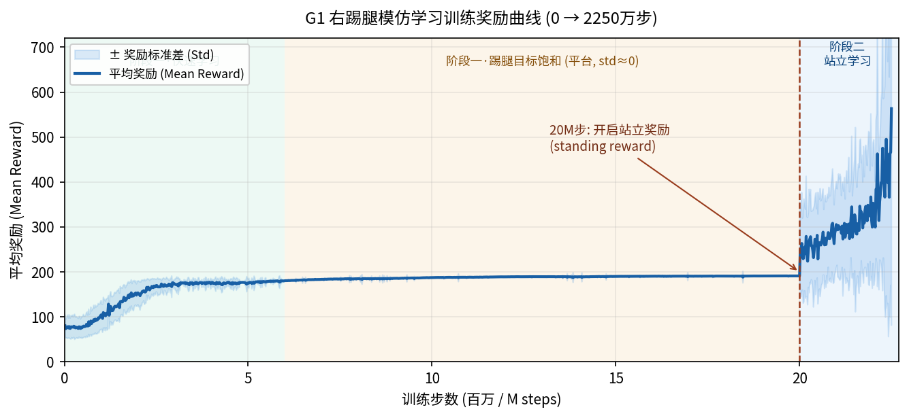

**第一阶段（0 – 2000 万步）：专注踢腿动作本身**
关闭站立奖励（`enable_standing_reward = false`），回合在踢腿结束帧即终止，目标单一。奖励在前约 600 万步内由约 80 快速上升至约 190，随后进入长达约 1400 万步的平台期，奖励稳定在 190 附近、标准差趋近于 0——表明在"仅踢腿"这一目标下，策略已收敛为一个干净、可复现的近确定性踢腿动作，学满了该目标所能提供的全部信息。但此阶段并未考核踢腿结束后的站立稳定性，因此机器人在 2000 万步时踢腿动作标准、但踢完无法稳定站立。

**第二阶段（2000 万 – 2250 万步）：引入站立奖励，习得踢后稳定站立**
在 2000 万步处开启站立奖励（站立姿态匹配 + 保持直立 + 站定不动，权重 0.3），为策略引入一个更难的新目标：踢腿结束后回归并保持自然站立。曲线随即跃升，标准差显著增大——这是新目标引入后二次学习的正常表现：部分智能体率先学会站立（奖励高）、部分仍会摔倒（奖励低），方差随训练逐步收敛。训练至 2250 万步时，机器人已能连贯完成右腿前踢、收腿、并稳稳回归直立站姿，全程不摔倒，动作顺滑、过渡自然，达到了任务对"预期且顺滑"的要求。

### 分析与方法学说明

1. **训练成功的真正证据是行为，而非奖励数值。** 需要特别说明的是，第二阶段奖励由约 191 跃升至约 563，其中相当一部分是"机械性"上升——因为在 2000 万步处**新增了一个奖励项**，总奖励量纲本身随之增大，故 2000 万步前后的奖励数值不在同一标准下、不可直接比较。本次训练成功的判据应以实际行为指标（踢后能否稳定站立、站立时长、是否摔倒）为准，仿真录像验证了机器人确已习得踢后稳定站立的能力。

2. **平台期是推进课程阶段的信号。** 踢腿动作本身约在 600 万步即已学成，其后约 1400 万步处于"奖励停滞、标准差趋零"的平台期，并无新的学习信号。这提示：当观察到奖励进入平台、标准差趋近于 0 时，即应推进课程阶段（引入站立、抗干扰、连招衔接等新目标），而非按固定步数继续训练。后续动作（左拳/右拳/左踢腿）的训练将以此为启发，把"奖励平台 + std→0"作为切换目标的触发条件，以提升训练效率。

右踢腿动作执行与踢后站立稳定演示：

https://github.com/user-attachments/assets/b315ffec-9b5b-4137-9fc2-9a4d4c01ebf5

### 产出
- [修改后的控制脚本G1mimic1Agent_RightKick.cs](code/G1mimic1Agent_RightKick.cs)
- [训练好的右踢腿onnx模型（已验证踢后能稳定站立）](models/gewu-22507482(RightKick).onnx)

### 下周计划

- 按本周确立的流程，训练右勾拳、左勾拳、左踢腿等动作。
- 尝试将第二周调优过的超参（`batch_size 4096`、`buffer 40960`、`lr 0.0001`）应用于分动作训练，对比收敛效率。
- 探索多动作（拳 + 踢）的衔接与统一策略训练。

---

## 第二周 (4.3)

### 模型改进
针对第一周暴露的问题，我对 `G1mimicAgent.cs` 和 `config.yaml` 代码进行了系统性改进，核心思路与改进内容如下：

1. **降低控制灵敏度，抑制关节震荡**  
   原始代码将神经网络输出的动作值直接乘以增益 50 叠加到关节目标角度上，导致轻微的策略噪声即被放大为剧烈的关节抖动。改进后将动作增益 `kb` 从 50 降低至 5.0，并引入 `maxCorrectionDeg = 10°` 的缩放因子，将网络输出映射到 ±10° 的合理修正范围内，从而在保留足够调节能力的同时大幅提升关节运动的平滑性与可控性。

2. **启用躯干主动平衡力矩**  
   原始代码中将根节点的旋转扭矩置零（`art0.AddTorque(0*rotationTorque)`），使得机器人只能被动跟随参考位置，无法主动调节躯干姿态。改进后启用了旋转扭矩跟踪逻辑，并配合调整后的旋转 PD 参数（`rotationKp = 500`，`rotationKd = 30`），使策略能够在躯干发生倾斜时主动施加恢复力矩，显著增强了动态平衡能力，大幅降低了摔倒概率。

3. **重构奖励函数，增加平滑性与稳定性导向**  
   在原有的位置误差惩罚和旋转误差惩罚基础上，新增了两项关键奖励项：
   - **关节速度平滑奖励**：对 29 个关节的速度绝对值施加惩罚（系数 `-0.005`），直接抑制高频抖动。
   - **根角速度惩罚**：对躯干的角速度大小施加惩罚（系数 `-0.05`），防止策略产生剧烈的身体旋转。
   同时，适度增大了旋转跟踪误差的惩罚权重（从 `-0.01` 调整为 `-0.02`），进一步强调躯干稳定在整体优化目标中的重要性。

4. **优化终止条件，采用渐进式课程学习**  
   原始代码采用固定的终止阈值（躯干倾角超过 40° 或根位移超过 0.5m 即结束回合），导致策略在训练初期频繁被截断，无法观察到完整动作序列。改进后采用渐进式课程策略：
   - **阈值动态收紧**：终止倾角阈值从初期的 60° 线性递减至后期的 25°，位移阈值从 0.8m 递减至 0.3m。
   - **最小存活保护**：要求回合必须执行超过 100 帧后才开始判定终止，给予策略充分的探索与适应时间。
   - **奖励引导**：为完整执行到动作序列末尾的回合提供 +5 额外奖励，为提前摔倒提供 -5 惩罚。
   这套机制使策略能够在初期宽松的环境中学会大致动作框架，再在后期严格的约束下精调稳定性。

5. **扩充观察空间，提供前馈参考信息**  
   原始观察空间仅包含部分根姿态信息（61 维），策略缺乏对参考轨迹的全局感知。改进后新增了三类关键观察：
   - **根线速度**（3 维）：帮助策略感知自身运动趋势。
   - **参考关节角度**（29 维）：提供逐关节的目标前馈值，使网络能够直接对比当前状态与目标状态。
   - **参考根姿态误差**（位置误差 3 维 + 旋转误差四元数 4 维）：显式地将跟踪偏差作为输入。
   观察空间总维度从 61 扩充至 103，显著提升了策略对目标动作的预判能力与跟踪精度。

6. **调整超参数，稳定收敛过程**  
   在 `config.yaml` 中，将学习率从 `0.0003` 降低至 `0.0001` 以保证后期收敛的平稳性；将 `batch_size` 从 2048 提升至 4096、`buffer_size` 从 20480 提升至 40960 以提高梯度估计的准确度；将 `time_horizon` 从 1000 缩短至 500 以加快信用分配速度；将折扣因子 `gamma` 从 0.995 微调至 0.99，使策略更关注近期的奖励信号。

### 最终训练效果与实际表现
经过上述改进，训练时间约为 5 个小时，模型在 2000 万步内稳定收敛，奖励值从初期负值 (约-127) 持续上升至约 386。整个训练过程的奖励曲线如下图所示：平均奖励由约 −127 平滑、单调地上升至约 387 后收敛，全程标准差仅 4–10，无明显震荡——直观印证了上述各项改进（抑制关节震荡、启用主动平衡、平滑奖励、稳定收敛超参）对训练稳定性的提升。
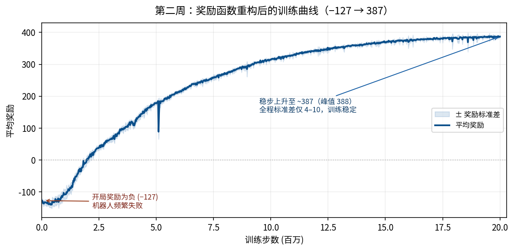

实际运行测试中，机器人能够连续 20 秒以上稳定执行左勾拳、右勾拳、左踢腿、右踢腿等动作，全程无摔倒，关节运动平滑流畅，动作过渡自然，效果很好，完全满足项目对“稳定执行”的要求。

### 运行截图与视频
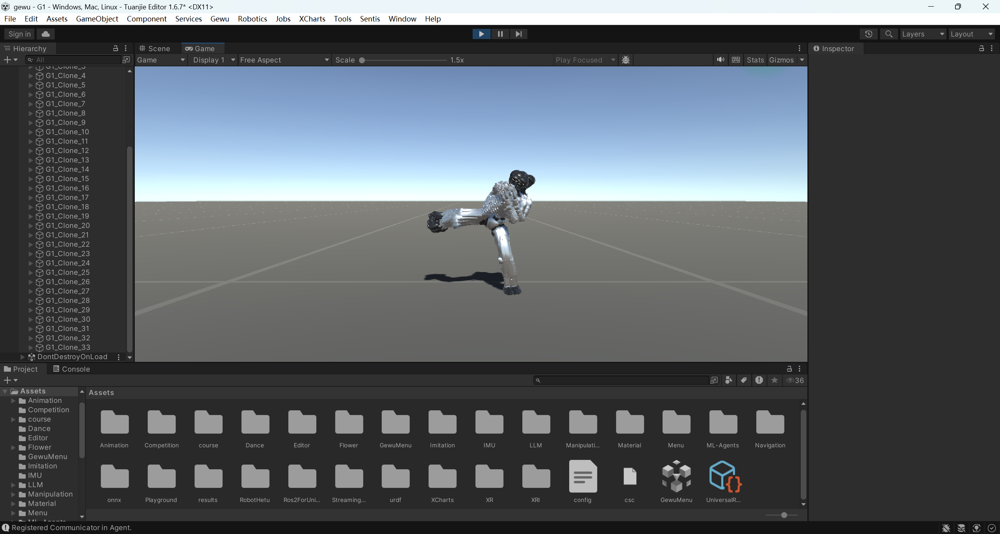
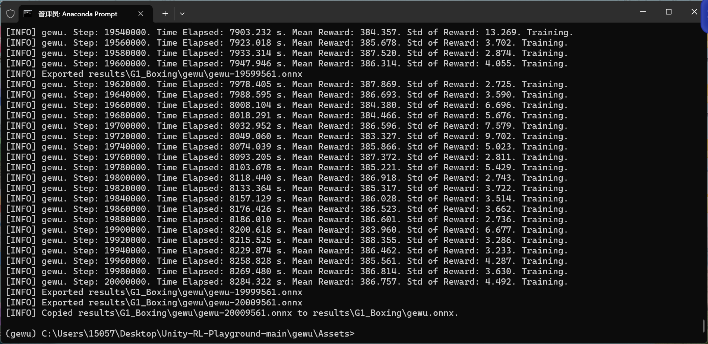

https://github.com/user-attachments/assets/4b804aa2-970e-45cd-8354-a7a6cbf37eee

改进后的代码及训练好的模型已上传至code文件夹中：

- [配置文件config.yaml](code/config.yaml)
- [控制脚本G1mimicAgent.cs](code/G1mimicAgent.cs)
- [模型文件gewu-20009561.onnx](models/gewu-20009561.onnx)

---

## 第一周 (3.27)

### 工作内容
- 安装 Unity 编辑器，部署最新版“格物”平台（G1 机器人仿真环境）。
- 使用未改进的原始代码对拳击动作数据进行基线训练，累计 1000 万步（训练约 3 个小时）。
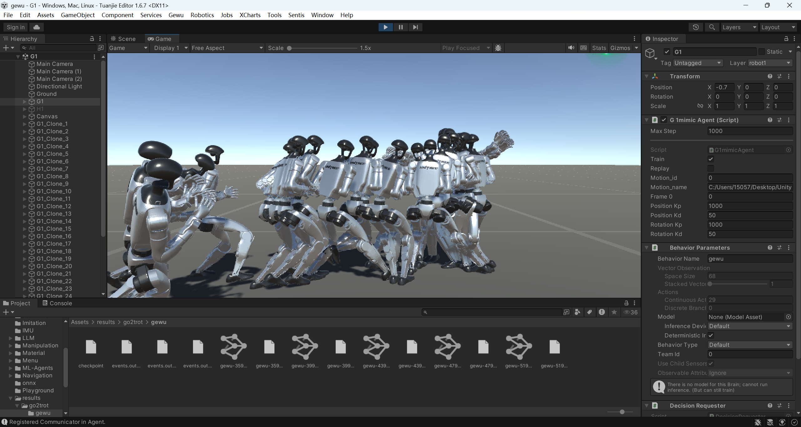
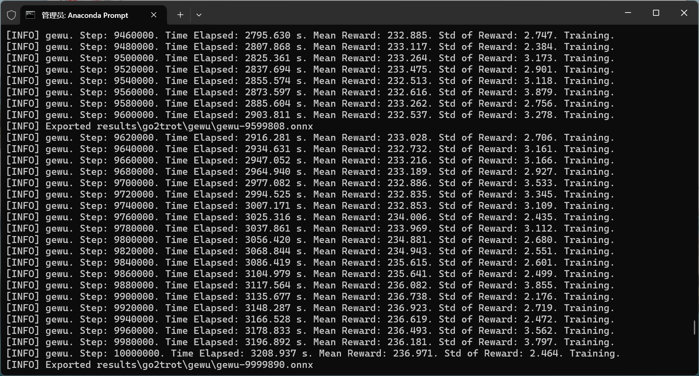

### 实际表现
训练过程中奖励值虽逐步上升，但机器人实际仿真表现很差：执行动作时频繁摔倒，无法完成连续动作。经过分析，问题根源在于原始代码的控制增益过大、缺乏主动平衡力矩、奖励函数缺少平滑约束，且观察空间信息不足。针对上述问题，计划在下周对奖励函数与训练配置进行重点改进并重新训练。

运行视频：

https://github.com/user-attachments/assets/c8c59c07-b24c-413d-9da1-ec3ad08927f8
