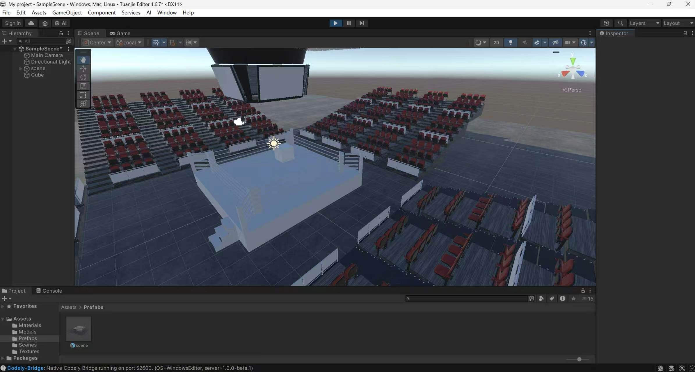

## 第十一周 (5.22) — Unity 场景集成、物理碰撞系统搭建与训练环境落地

本周完成拳击赛场景在团结引擎（Tuanjie/Unity）中的集成、物理碰撞体系搭建、资产封装与团队分享，并最终接入 G1 机器人模仿学习训练环境，使机器人能够在真实擂台中进行拳击对战仿真。

### 工作内容

1. **FBX 导入**
   将上周导出的 FBX 导入团结引擎项目，并建立标准化资源目录结构（`Models/`、`Materials/`、`Textures/`、`Prefabs/`），便于团队协作与后续维护。导入后核查根物体 Transform，确认缩放为 `(1,1,1)`、旋转归零，验证了上周变换归一化的有效性。

2. **材质与贴图提取、渲染校正**
   通过 FBX 导入设置中的 **Extract Textures / Extract Materials** 将内嵌贴图与材质提取至独立目录，使其可在引擎内编辑。针对 Blender 与 Unity 色彩空间差异导致的材质偏暗问题，逐一指定 Base Map 并调整 Smoothness / Metallic 参数，还原擂台、围绳、护角等材质的真实质感。

3. **碰撞体系统搭建**
   这是本周的核心与难点。为避免直接对整套高模添加 Mesh Collider 带来的性能开销与凹形碰撞失效问题，采用"按部位手动添加简单碰撞体"的策略，对擂台各功能部件分别配置：
   - **台面 `boxing_ring_arena_mesh.002`**：添加 Box Collider，逐面调整 Center 与 Size，使碰撞盒顶面与视觉台面严格齐平，避免机器人足部陷入或悬空。
   - **四根角柱 `boxing_ring_corner_cushions_002_mesh.002`**：由于四根角柱共属同一网格物体，引擎自动生成的单个 Box Collider 会将四柱之间的空白区域一并包入。考虑到对战仿真中角柱仅需提供"阻挡机器人冲出擂台"的物理边界、对精确外形要求不高，采用**在同一物体上叠加 4 个独立 Box Collider** 的方案，分别调整 Center / Size 包裹各角柱，在保证物理边界正确的同时兼顾了实现效率。（注：角柱实际为三棱柱外形，已评估 Mesh Collider+Convex 与 Capsule 等替代方案的精度/性能权衡，最终选定 Box 多碰撞体方案）
   - **围绳 `Retopo_boxing_ring_ropes_mesh.003`、`Retopo_boxing_ring_ropes_mesh.004`**：沿围绳走向布置细长 Box Collider，构成擂台四周的物理围挡，为后续实现"机器人撞绳反弹"等交互预留接口。

   

4. **"Is Trigger 穿模"问题的定位与修复**
   碰撞测试初期出现机器人/测试物体直接穿过台面的现象。逐项排查后定位根因：台面 Box Collider 误勾选了 **Is Trigger**。触发器（Trigger）仅用于检测物体进入而不产生物理阻挡，故无法承托物体。取消勾选后台面恢复正常物理碰撞。该问题的排查过程加深了对 Unity 中 Collider 与 Trigger 语义区别的理解。

5. **碰撞测试与验证**
   采用"标准 Cube + Rigidbody"作为临时测试体，从擂台上方自由下落进行碰撞验证：确认测试体能稳定停落于台面而不穿透、不抖动、不卡入，且四周围挡与角柱均能正确阻挡。验证通过后方进入正式集成。

   https://github.com/user-attachments/assets/bd6c2437-6ad5-40be-a254-63056e13c29d

6. **Prefab 封装与 Unity Package 团队分享**
   将配置完成的擂台（含完整碰撞体系、材质、子物体层级）从 Hierarchy 拖拽至 `Prefabs/` 目录封装为 **Prefab 预制体**，实现配置的持久化与跨场景复用——后续任意训练/对战场景只需拖入该 Prefab 即可获得完全一致的可碰撞擂台。随后通过 **Export Package（勾选 Include Dependencies）** 将 Prefab 及其依赖的材质、贴图、模型一并打包为 `.unitypackage`，分享给团队成员，统一了团队的场景资产基线。

7. **接入 G1 模仿学习训练环境**
   将封装好的擂台 Prefab 集成进 G1 机器人模仿学习项目，替换原有的空白训练地面。集成后，G1 机器人可在具备完整物理边界与视觉上下文的真实擂台中执行模仿学习训练与拳击对战仿真（见下图），为项目从"单体动作"迈向"擂台对战"提供了场景支撑。

   

### 阶段成果

- 完成拳击赛场景在团结引擎中的完整集成，擂台台面、角柱、围绳均具备正确的物理碰撞，机器人可稳定站立、移动而不穿模。
- 将擂台封装为可复用 Prefab 并以 Unity Package 形式完成团队分享，统一了场景资产。
- 成功将场景接入 G1 模仿学习训练环境，G1 机器人已可在真实擂台内进行对战仿真。

打包后的场景资产（`BoxingRing.zip`，约 752 MB）及相关工程文件已上传至项目仓库：

- 项目仓库：[https://github.com/ZhouWho/UnitedWork](https://github.com/ZhouWho/UnitedWork)

### 下周计划

- 优化观众席等环境物件的渲染性能（GPU Instancing / 静态合批），降低场景 Draw Call。
- 完善围绳的弹性碰撞反馈，实现机器人撞绳后的反弹交互。
- 配合对战逻辑，在擂台四周补充不可见边界墙，防止机器人意外冲出擂台。

---

## 第十周 (5.15) — 拳击赛场景的获取、模型适配与导出

本周起，项目从"机器人单体动作训练"进入"对战场景搭建"阶段。目标是为 G1 机器人模仿学习提供一个真实、规范、可碰撞的拳击赛擂台环境，替代此前训练所用的空白地面，使后续的拳击对战仿真具备完整的场景上下文与物理边界。

### 工作内容

1. **场景模型选型与结构分析**
   选用一套高精度拳击赛场馆 3D 资产（含擂台、围绳、护角、玻璃护栏、观众席、灯光桁架、LED 大屏等），原始格式为 Blender `.blend` 工程文件。导入后对场景层级（Outliner）进行了系统梳理，明确各集合的归属与用途：`01 BOXING RING`（擂台主体）、`02 LIGHTS`（28 个聚光/区域光源）、`03 CAMERA`、`01 OBJECTS`（观众席、桁架等环境物件）、`Boxing ring`、`Glass Handrail with lines` 以及若干 `Empty` 辅助空物体。该步骤为后续的导出裁剪与碰撞规划提供了依据。

2. **多用户（Multi-User）数据问题排查与修复**
   在尝试对模型执行"应用全部变换（Apply All Transforms）"时，控制台抛出大量 `Cannot apply to a multi user: Object "Floor0X.001", Mesh "Floor01_..."` 报错，导致变换无法应用。经分析，根因在于原作者为压缩文件体积，对场景内数十个地板/座椅物体采用了**关联复制（Alt+D）**，使多个物体共享同一份网格数据（Multi-User Data），Blender 出于数据一致性保护禁止对其单独应用变换。
   解决方案：全选目标物体后执行 **物体 → 关系 → 单用户化 → 物体与数据（Make Single User → Object & Data）**，将每个物体的网格数据独立化，随后顺利完成变换应用。

3. **3D 模型坐标与单位的归一化适配**
   对导入模型逐一核查变换属性，发现并修复了三类会直接破坏 Unity 导入效果的问题：
   - **缩放未归一**：部分物体缩放值为 `0.011`（即被缩小至原尺寸的 1.1%），若直接导出会导致 Unity 中 Transform 缩放异常，进而引发物理碰撞、动画驱动的尺度错乱。通过 **Ctrl+A → 全部变换** 将缩放归一为 1.0。
   - **旋转未归零**：部分物体存在 `X=90°`、`Z=-270°` 等残留旋转，源于资产跨软件导入时的轴向差异。统一应用变换后归零，避免子物体层级与朝向计算混乱。
   - **单位制不一致**：工程显示单位为厘米（cm），而 Unity 默认 1 单位 = 1 米。核对擂台真实尺寸（约 6.1m × 6.1m）并在场景属性中将单位系统统一为公制·米，确保导入后比例正确。

4. **导出范围裁剪与场景轻量化**
   考虑到机器人对战仿真对实时性能的要求，对导出内容进行了有针对性的取舍：保留擂台主体、护角、围绳、玻璃护栏等核心几何体；剔除 `02 LIGHTS` 全部光源（Unity 端自行布光，效果更可控且避免重复光照）、`03 CAMERA`、以及全部 `Empty` 辅助物体，从源头减少无效 Draw Call 与场景冗余。

5. **FBX 导出参数配置**
   采用 **FBX 导出**作为 Blender → Unity 的资产交换方案（相比直接拖入 `.blend`，FBX 不依赖本地 Blender 环境，更利于团队协作与版本管理）。关键参数设置：勾选"仅选中的物体"；物体类型仅保留"网格"；缩放 1.0、应用缩放 = `FBX 全部`；前进方向 = `-Z`、向上方向 = `Y`（对齐 Unity 的 Y-up 坐标系）；勾选"应用单位制"；路径模式 = 复制并启用**贴图嵌入**，保证材质贴图随 FBX 一并迁移。

6. **材质渲染校验**
   通过切换视口着色模式（实体 → 材质预览）确认模型材质完整，擂台地面、Everlast 标识、围绳、观众席座椅等贴图均正常显示，排除了"无材质纯灰模型"的可能，为 Unity 端材质还原奠定基础。

### 阶段成果

完成了一套结构清晰、变换归一、单位规范、可正确导出的拳击赛场景 FBX 资产。模型在 Blender 中渲染效果完整（见下图），为下一周的 Unity 集成与物理碰撞搭建做好了准备。

---

## 第二周 (4.3)

### 模型改进
针对第一周暴露的问题，我对 `G1mimicAgent.cs` 和 `config.yaml` 代码进行了系统性改进，核心思路与改进内容如下：

1. **降低控制灵敏度，抑制关节震荡**  
   原始代码将神经网络输出的动作值直接乘以增益 50 叠加到关节目标角度上，导致轻微的策略噪声即被放大为剧烈的关节抖动。改进后将动作增益 `kb` 从 50 降低至 5.0，并引入 `maxCorrectionDeg = 10°` 的缩放因子，将网络输出映射到 ±10° 的合理修正范围内，从而在保留足够调节能力的同时大幅提升关节运动的平滑性与可控性。

2. **启用躯干主动平衡力矩**  
   原始代码中将根节点的旋转扭矩置零（`art0.AddTorque(0*rotationTorque)`），使得机器人只能被动跟随参考位置，无法主动调节躯干姿态。改进后启用了旋转扭矩跟踪逻辑，并配合调整后的旋转 PD 参数（`rotationKp = 500`，`rotationKd = 30`），使策略能够在躯干发生倾斜时主动施加恢复力矩，显著增强了动态平衡能力，大幅降低了摔倒概率。

3. **重构奖励函数，增加平滑性与稳定性导向**  
   在原有的位置误差惩罚和旋转误差惩罚基础上，新增了两项关键奖励项：
   - **关节速度平滑奖励**：对 29 个关节的速度绝对值施加惩罚（系数 `-0.005`），直接抑制高频抖动。
   - **根角速度惩罚**：对躯干的角速度大小施加惩罚（系数 `-0.05`），防止策略产生剧烈的身体旋转。
   同时，适度增大了旋转跟踪误差的惩罚权重（从 `-0.01` 调整为 `-0.02`），进一步强调躯干稳定在整体优化目标中的重要性。

4. **优化终止条件，采用渐进式课程学习**  
   原始代码采用固定的终止阈值（躯干倾角超过 40° 或根位移超过 0.5m 即结束回合），导致策略在训练初期频繁被截断，无法观察到完整动作序列。改进后采用渐进式课程策略：
   - **阈值动态收紧**：终止倾角阈值从初期的 60° 线性递减至后期的 25°，位移阈值从 0.8m 递减至 0.3m。
   - **最小存活保护**：要求回合必须执行超过 100 帧后才开始判定终止，给予策略充分的探索与适应时间。
   - **奖励引导**：为完整执行到动作序列末尾的回合提供 +5 额外奖励，为提前摔倒提供 -5 惩罚。
   这套机制使策略能够在初期宽松的环境中学会大致动作框架，再在后期严格的约束下精调稳定性。

5. **扩充观察空间，提供前馈参考信息**  
   原始观察空间仅包含部分根姿态信息（61 维），策略缺乏对参考轨迹的全局感知。改进后新增了三类关键观察：
   - **根线速度**（3 维）：帮助策略感知自身运动趋势。
   - **参考关节角度**（29 维）：提供逐关节的目标前馈值，使网络能够直接对比当前状态与目标状态。
   - **参考根姿态误差**（位置误差 3 维 + 旋转误差四元数 4 维）：显式地将跟踪偏差作为输入。
   观察空间总维度从 61 扩充至 103，显著提升了策略对目标动作的预判能力与跟踪精度。

6. **调整超参数，稳定收敛过程**  
   在 `config.yaml` 中，将学习率从 `0.0003` 降低至 `0.0001` 以保证后期收敛的平稳性；将 `batch_size` 从 2048 提升至 4096、`buffer_size` 从 20480 提升至 40960 以提高梯度估计的准确度；将 `time_horizon` 从 1000 缩短至 500 以加快信用分配速度；将折扣因子 `gamma` 从 0.995 微调至 0.99，使策略更关注近期的奖励信号。

### 最终训练效果与实际表现
经过上述改进，训练时间约为 5 个小时，模型在 2000 万步内稳定收敛，奖励值从初期负值 (约-127) 持续上升至约 386。实际运行测试中，机器人能够连续 20 秒以上稳定执行左勾拳、右勾拳、左踢腿、右踢腿等动作，全程无摔倒，关节运动平滑流畅，动作过渡自然，效果很好，完全满足项目对“稳定执行”的要求。

### 运行截图与视频

https://github.com/user-attachments/assets/9dbde9f3-b4dc-40ec-b584-ac4b85ab41ab

改进后的代码及训练好的模型已上传至code文件夹中：

- [配置文件config.yaml](code/config.yaml)
- [控制脚本G1mimicAgent.cs](code/G1mimicAgent.cs)
- [模型文件gewu-20009561.onnx](code/gewu-20009561.onnx)

---

## 第一周 (3.27)

### 工作内容
- 安装 Unity 编辑器，部署最新版“格物”平台（G1 机器人仿真环境）。
- 使用未改进的原始代码对拳击动作数据进行基线训练，累计 1000 万步（训练约 3 个小时）。

### 实际表现
训练过程中奖励值虽逐步上升，但机器人实际仿真表现很差：执行动作时频繁摔倒，无法完成连续动作。经过分析，问题根源在于原始代码的控制增益过大、缺乏主动平衡力矩、奖励函数缺少平滑约束，且观察空间信息不足。针对上述问题，计划在下周对奖励函数与训练配置进行重点改进并重新训练。

运行视频：

https://github.com/user-attachments/assets/2090a935-ada1-42c0-8ad8-3f4889e1e13f